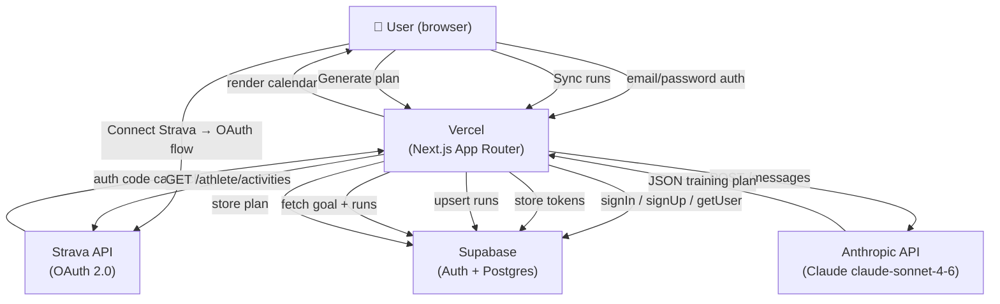
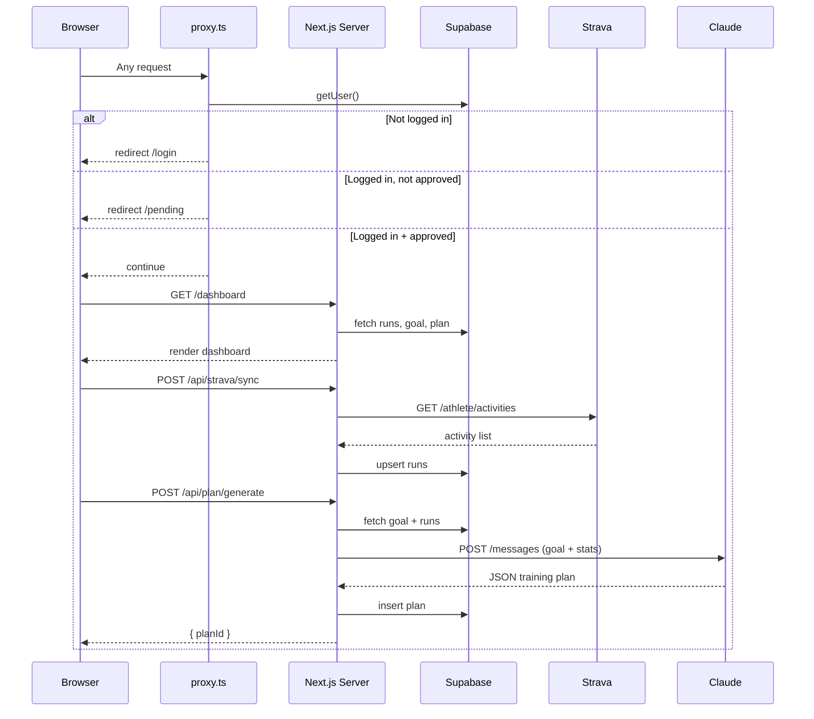
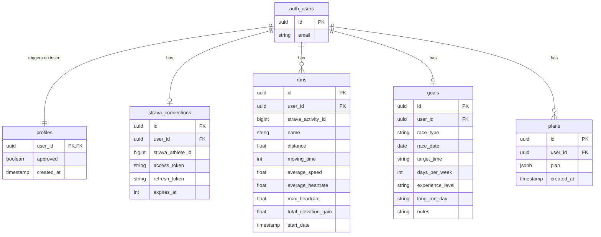
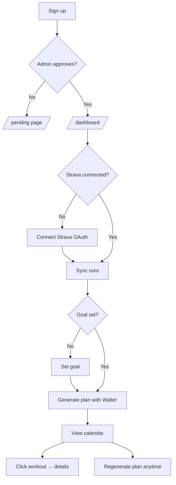

# Walter — AI Running Coach

Walter is a personal running training plan app inspired by [Runna](https://runna.com). Named after the trainer from the duathlon club. It connects your Strava account, analyses your training history, and uses Claude AI to generate a personalised multi-week training plan displayed on an interactive calendar.

Live at: **[walter-lemon.vercel.app](https://walter-lemon.vercel.app)**

---

## What it does

1. Sign up with email → wait for admin approval
2. Connect Strava → sync your last 365 days of runs
3. Set a goal (race type, date, experience level)
4. Ask Walter to generate a plan → Claude builds a structured week-by-week schedule
5. View the plan on a monthly calendar, click any day for workout details

---

## Architecture



---

## Request flow (per page load)



---

## Database schema



The `plan` column is a JSONB blob with this shape:

```json
{
  "summary": "16-week marathon plan for an intermediate runner",
  "total_weeks": 16,
  "start_date": "2025-05-06",
  "weeks": [
    {
      "week": 1,
      "theme": "Base building",
      "total_km": 45,
      "workouts": [
        {
          "day": "Tuesday",
          "type": "Easy Run",
          "distance_km": 10,
          "pace_min_per_km": "5:45",
          "description": "Easy aerobic run at conversational pace"
        }
      ]
    }
  ]
}
```

---

## User flow



---

## Tech stack

| Layer | Tech |
|---|---|
| Framework | Next.js 16 (App Router, Server Actions) |
| Hosting | Vercel (automatic deploys from GitHub) |
| Auth + DB | Supabase (email/password, Postgres, RLS) |
| Strava | OAuth 2.0, REST API v3 |
| AI | Anthropic Claude claude-sonnet-4-6 via `@anthropic-ai/sdk` |
| Styling | Tailwind CSS v4, dark theme (`#0a0a0f`) |
| Calendar | Custom-built React component |

---

## Project structure

```
app/
  login/          — sign in / sign up (Server Actions)
  pending/        — waiting room for unapproved users
  dashboard/
    page.tsx      — main dashboard (stats, calendar, Walter quotes)
    goals/        — set/edit race goal
    plan/[id]/    — list view of a plan
    SyncButton    — triggers /api/strava/sync
    GeneratePlanButton — triggers /api/plan/generate
  api/
    auth/signout/ — sign out route
    strava/
      callback/   — Strava OAuth callback, stores tokens
      sync/       — fetches + upserts last 365d of runs
    plan/
      generate/   — computes stats, calls Claude, stores plan

components/
  TrainingCalendar.tsx — monthly calendar grid with workout pills

lib/
  claude.ts       — generateTrainingPlan() — calls Anthropic API
  planUtils.ts    — planToEvents() — maps plan weeks to calendar dates
  strava.ts       — getValidStravaToken() — handles token refresh
  supabase/       — createClient() for server and browser

proxy.ts          — auth + approval middleware (runs on every request)
```

---

## Environment variables

```env
# Supabase
NEXT_PUBLIC_SUPABASE_URL=https://xxxx.supabase.co
NEXT_PUBLIC_SUPABASE_ANON_KEY=eyJ...

# Strava
STRAVA_CLIENT_ID=12345
STRAVA_CLIENT_SECRET=abc...
STRAVA_REDIRECT_URI=https://walter-lemon.vercel.app/api/strava/callback

# Anthropic
ANTHROPIC_API_KEY=sk-ant-...
```

---

## Approval system

New signups land on `/pending` and cannot access the dashboard until a row exists in the `profiles` table with `approved = true`. A Postgres trigger auto-creates the profile row on signup (with `approved = false`). To approve a user, run this in the Supabase SQL editor:

```sql
UPDATE profiles SET approved = true WHERE user_id = (
  SELECT id FROM auth.users WHERE email = 'user@example.com'
);
```

This protects against unlimited Claude API usage by strangers.

---

## Strava API note

New Strava API applications are limited to **1 connected athlete** by default. To allow friends to connect, you must apply for expanded access at [strava.com/settings/api](https://www.strava.com/settings/api).
